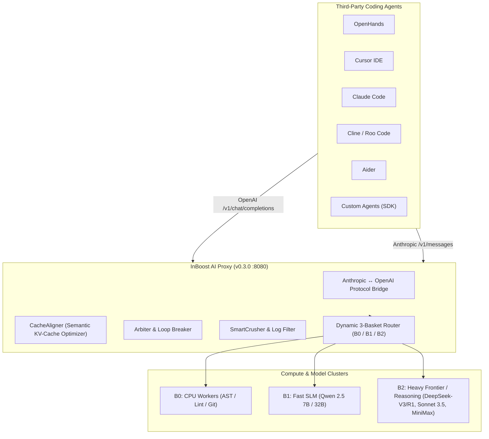
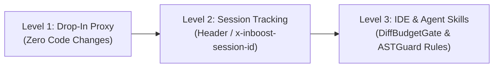
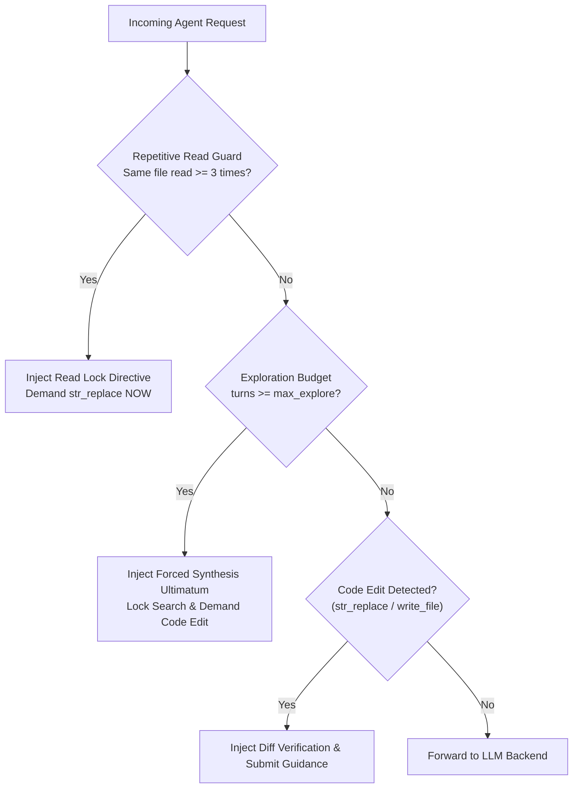

# InBoost AI Proxy: Third-Party Agent Integration Guide

[](https://github.com/inboost-dev/inboost-ai-proxy-runtime)
[](https://github.com/inboost-dev/inboost-ai-proxy-runtime)
[](https://github.com/inboost-dev/inboost-ai-proxy-runtime)

Comprehensive production integration guide for connecting **OpenHands**, **Cursor**, **Claude Code**, **Cline**, **Roo Code**, **Aider**, and custom autonomous agent frameworks to `InBoost AI Proxy v0.3.0`.

---

## 📑 Table of Contents

1. [Architectural Overview](#1-architectural-overview)
2. [What Agents Automatically Gain](#2-what-agents-automatically-gain)
3. [Integration Levels (Zero-Code to Graph-Enriched)](#3-integration-levels)
4. [Step-by-Step Agent Configuration](#4-step-by-step-agent-configuration)
   - [OpenHands](#openhands)
   - [Cursor IDE](#cursor-ide)
   - [Claude Code (Anthropic CLI)](#claude-code-anthropic-cli)
   - [Cline & Roo Code (VS Code)](#cline--roo-code-vs-code)
   - [Aider](#aider)
   - [Custom Agent Frameworks (Python / TypeScript / LangChain)](#custom-agent-frameworks)
5. [Proxy Guardrails & Dynamic Interceptors](#5-proxy-guardrails--dynamic-interceptors)
6. [Verification, Health Checks & Diagnostics](#6-verification-health-checks--diagnostics)
7. [Troubleshooting & FAQ](#7-troubleshooting--faq)

---

## 1. Architectural Overview

`InBoost AI Proxy` acts as an intelligent, high-throughput network proxy positioned directly between autonomous coding agents and LLM backends (local vLLM/SGLang clusters, private cloud endpoints, DeepSeek, OpenAI, Anthropic).



---

## 2. What Agents Automatically Gain

When a third-party agent routes through InBoost AI Proxy, it inherits enterprise agent capabilities **with zero modifications to agent code**:

| Capability | Mechanism | Business / Performance Impact |
| :--- | :--- | :--- |
| **Prefix KV-Cache Hit Maximization** | **CacheAligner** stabilizes volatile timestamps, ephemeral file paths, and sorts JSON keys. | **35–48% cost reduction** and **2–3x faster TTFT** (Time to First Token) on vLLM/SGLang/Ollama and OpenAI-compatible gateways. |
| **Universal Protocol Translation** | **Protocol Bridge** accepts Anthropic `/v1/messages` and OpenAI `/v1/chat/completions` interchangeably. | Run Anthropic-only tools (Claude Code, Cline) on private DeepSeek-V3 or local open-weights clusters. |
| **Repetitive Read Guard** | Intercepts agent loops where the same file is inspected $\ge 3$ times without edits. | Eliminates reading loops (e.g. `seaborn-3187`, `pylint-6386`), saving 10–20 wasteful turns. |
| **Forced Synthesis Ultimatum** | Locks exploration tools when search budget is exhausted, demanding code edits. | Prevents credit burn and wandering agents; boosts patch generation rate from 0% to 40%+ on tough cases. |
| **Post-Edit Submission Steering** | Guides model to run `git diff` and call `submit` immediately after applying fixes. | Reduces step count by 30–50% per resolved task. |
| **Context Window Compression** | **SmartCrusher** factors JSON record schemas and prunes repetitive terminal stack traces. | Saves 40–70% context window tokens on test failures and build outputs. |

---

## 3. Integration Levels

Choose the integration level that best fits your workflow:



- **Level 1: Drop-In Proxy (Zero Code Changes)**  
  Point the agent's base URL to `http://localhost:8080/v1`. The proxy applies CacheAligner, protocol conversion, log crushing, and default exploration limits automatically.
- **Level 2: Session Tracking**  
  Pass the header `x-inboost-session-id: <session_id>` or include it in client metadata. Enables persistent session KV-lease, per-task metrics, and history-aware routing.
- **Level 3: IDE & Agent Skills Integration**  
  Install the bundled InBoost skills or configure agent rules (`.cursorrules`, `CLAUDE.md`, `.clinerules`) to align agent behavior with surgical diff budgets, AST preservation, and loop prevention.

---

## 4. Step-by-Step Agent Configuration

### OpenHands

OpenHands can be configured via `config.toml` or environment variables.

#### Option A: `config.toml`

Add or update the `[llm]` section in your OpenHands `config.toml`:

```toml
[llm]
model = "inboost-adaptive"
base_url = "http://localhost:8080/v1"
api_key = "inboost-local"
custom_llm_provider = "openai"
max_input_tokens = 64000
max_output_tokens = 4096
temperature = 0.0

[llm.custom_headers]
x-inboost-session-id = "openhands-session-01"
```

#### Option B: Environment Variables (Docker / CLI)

```bash
export OPENAI_BASE_URL="http://localhost:8080/v1"
export OPENAI_API_KEY="inboost-local"
export LLM_MODEL="inboost-adaptive"
export LLM_BASE_URL="http://localhost:8080/v1"

# Run OpenHands container
docker run -it --rm \
  -e OPENAI_BASE_URL="http://host.docker.internal:8080/v1" \
  -e OPENAI_API_KEY="inboost-local" \
  -e LLM_MODEL="inboost-adaptive" \
  -p 3000:3000 \
  ghcr.io/all-hands-ai/openhands:latest
```

---

### Cursor IDE

Cursor supports custom OpenAI-compatible endpoints natively.

1. Open **Cursor Settings** (`Cmd + ,` or `Ctrl + ,`).
2. Navigate to **Features** $\rightarrow$ **Model**.
3. Under **OpenAI API Key**:
   - Toggle **Override OpenAI Base URL**: `ON`
   - Set Base URL: `http://localhost:8080/v1`
   - Enter API Key: `inboost-local` (or any string)
4. Under **Models**, click **Add Model**:
   - Model name: `inboost-adaptive` (or `minimax`, `deepseek-v3`, `qwen-2.5-32b`)
5. In Cursor Chat / Composer, select `inboost-adaptive`.

*All edits, diffs, and context reads from Cursor will now benefit from InBoost's CacheAligner and KV-cache acceleration.*

---

### Claude Code (Anthropic CLI)

Claude Code communicates using the Anthropic Messages API (`/v1/messages`). InBoost Proxy includes a built-in bidirectional protocol adapter that transparently translates Anthropic schemas to OpenAI-compatible upstream clusters (vLLM, DeepSeek, OpenAI, Groq).

1. Set the Anthropic base URL environment variable:

```bash
export ANTHROPIC_BASE_URL="http://localhost:8080"
export ANTHROPIC_API_KEY="inboost-local"
export CLAUDE_CODE_AUTO_MODE_SERVER=0
```

2. Launch Claude Code:

```bash
claude
```

Claude Code will connect directly to `http://localhost:8080/v1/messages`. InBoost Proxy handles streaming Server-Sent Events (SSE), tool use schema transformation (`tools` and `tool_choice`), and CacheAligner key normalization without client patching.

---

### Cline & Roo Code (VS Code)

Cline and Roo Code support both Anthropic and OpenAI Compatible providers.

#### Configuration in VS Code:
1. Open the **Cline / Roo Code** extension settings pane in VS Code.
2. Select **API Provider**: `OpenAI Compatible` (or `Anthropic Compatible`).
3. Set **Base URL**:
   - For OpenAI Compatible: `http://localhost:8080/v1`
   - For Anthropic Compatible: `http://localhost:8080`
4. Set **API Key**: `inboost-local`
5. Set **Model ID**: `inboost-adaptive`
6. (Optional) In **Custom Headers**:
   ```json
   {
     "x-inboost-session-id": "cline-workspace-session"
   }
   ```

---

### Aider

Aider is a leading terminal-based AI pair programming tool. It works out-of-the-box with InBoost Proxy via the OpenAI environment or CLI flags.

#### CLI Command:

```bash
aider \
  --openai-api-base http://localhost:8080/v1 \
  --openai-api-key inboost-local \
  --model inboost-adaptive \
  --no-show-model-warnings
```

#### Or via Shell Profile (`~/.bashrc` or `~/.zshrc`):

```bash
export OPENAI_BASE_URL="http://localhost:8080/v1"
export OPENAI_API_KEY="inboost-local"
export AIDER_MODEL="inboost-adaptive"
```

Then simply run:

```bash
aider
```

---

### Custom Agent Frameworks

Any agent written in Python or TypeScript using standard OpenAI or Anthropic SDKs connects seamlessly.

#### Python (`openai` SDK >= 1.0.0):

```python
import os
from openai import OpenAI

client = OpenAI(
    base_url="http://localhost:8080/v1",
    api_key="inboost-local",
    default_headers={"x-inboost-session-id": "my-agent-session-42"},
)

response = client.chat.completions.create(
    model="inboost-adaptive",
    messages=[
        {"role": "system", "content": "You are an autonomous bug-fixing agent."},
        {"role": "user", "content": "Fix AssertionError in tests/test_core.py."},
    ],
    temperature=0.0,
)

print(response.choices[0].message.content)
```

#### TypeScript / Node.js (`openai` npm):

```typescript
import OpenAI from "openai";

const client = new OpenAI({
  baseURL: "http://localhost:8080/v1",
  apiKey: "inboost-local",
  defaultHeaders: {
    "x-inboost-session-id": "ts-agent-session-101",
  },
});

async function run() {
  const completion = await client.chat.completions.create({
    model: "inboost-adaptive",
    messages: [{ role: "user", content: "Optimize SQL query in db.py" }],
  });
  console.log(completion.choices[0].message.content);
}

run();
```

---
---

## 5. Proxy Guardrails & Dynamic Interceptors

InBoost AI Proxy runs continuous in-flight trajectory analysis:



### 1. Repetitive Read Guard
If an agent executes `read_file` or `view` on the same file path 3 or more times without applying code edits, the proxy injects:
```
[InBoost Repetitive Read Guard]:
Repetitive inspection detected: `path/to/file.py` has already been read 3 times without modifications.
You already possess the context. Read operations on this file are locked.
You MUST now transition to code modification using `str_replace` or `write_file` to fix the issue.
```

### 2. Forced Synthesis Ultimatum
When exploration turns reach the configured budget (default: 12 turns):
```
[InBoost Arbiter Intervention]: Forced Synthesis Ultimatum
Exploration budget reached (12/12 turns). You have already inspected the identified files.
DO NOT run further read, search, or view commands.
You MUST generate the code modification tool call now using `str_replace` or `write_file`.
```

### 3. Post-Edit Submission Steering
After a successful code modification, the proxy appends guidance on the next observation:
```
[InBoost Diff Verification]:
Code modifications have been detected. Inspect your changes with `git diff` to confirm accuracy.
If the diff correctly resolves the issue, execute `submit` immediately to complete the task.
```

---

## 6. Verification, Health Checks & Diagnostics

### 1. Check Proxy Health

```bash
curl -i http://localhost:8080/health
```

Expected output:
```http
HTTP/1.1 200 OK
content-type: application/json

{"status":"healthy","uptime_seconds":124.5,"active_sessions":1}
```

### 2. Verify OpenAI Chat Completions

```bash
curl -X POST http://localhost:8080/v1/chat/completions \
  -H "Content-Type: application/json" \
  -H "Authorization: Bearer inboost-local" \
  -d '{
    "model": "inboost-adaptive",
    "messages": [
      {"role": "user", "content": "Respond with: InBoost Proxy Connected!"}
    ]
  }'
```

### 3. Verify Anthropic Protocol Bridge

```bash
curl -X POST http://localhost:8080/v1/messages \
  -H "Content-Type: application/json" \
  -H "x-api-key: inboost-local" \
  -H "anthropic-version: 2023-06-01" \
  -d '{
    "model": "claude-3-5-sonnet-20241022",
    "max_tokens": 128,
    "messages": [
      {"role": "user", "content": "Ping"}
    ]
  }'
```

### 4. Query Telemetry & Session Metrics

```bash
curl -s http://localhost:8080/v1/telemetry
```

---

## 7. Troubleshooting & FAQ

### Q1: The agent errors with `Connection refused` on `http://localhost:8080/v1`.
- Ensure InBoost AI Proxy is running: `python -m inboost_proxy.app config.example.yaml` or `docker compose up -d`.
- Check if port 8080 is occupied: `lsof -i :8080`.
- If running the agent inside a Docker container (e.g. OpenHands), use `http://host.docker.internal:8080/v1` instead of `localhost:8080`.

### Q2: Claude Code reports `Invalid Anthropic API Key`.
- InBoost Proxy validates requests locally. Provide any non-empty string for `ANTHROPIC_API_KEY` (e.g. `export ANTHROPIC_API_KEY="inboost-local"`).
- Ensure `ANTHROPIC_BASE_URL` is set without a trailing `/v1`: `export ANTHROPIC_BASE_URL="http://localhost:8080"`.

### Q3: How do I change the default exploration budget?
- Set the environment variable before starting the proxy:
  ```bash
  export INBOOST_MAX_EXPLORE_STEPS=14
  ```

### Q4: Can I inspect proxy routing decisions and token savings?
- Real-time metrics and routing decisions are logged to `proxy.log` and accessible via session debug endpoints.
- Total token savings, KV cache hit ratios, and arbiter interventions are returned in response headers (`x-inboost-cache-hit`, `x-inboost-basket`).

---

*All trademarks, logos, and brand names are property of their respective owners. See [LEGAL.md](../LEGAL.md) for full trademark and legal notices.*

*Distributed under [InBoost Free Community Software License](../LICENSE).*

